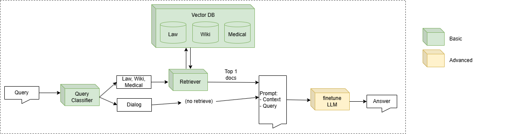

# CLOSE DOMAIN CHATBOT

## Introduction
This project is a close-domain chatbot that integrates fine-tuned Large Language Models (LLMs) and Retrieval-Augmented Generation (RAG) techniques. It is designed to provide domain-specific knowledge and responses across three domains: Vietnam Wiki, Vietnam Law, and Vietnam Medical.

## Architecture overview
The architecture of this chatbot is illustrated in the system design diagram below:

## Project status
The project is currently under development and is being continuously updated with new features and improvements.